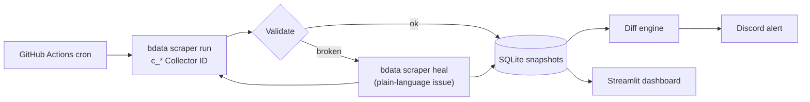

# 🕸️ Scrape-Verse — Self-Healing Competitive Intel Pipeline

> **Into the Scrape-Verse** hackathon submission (WeMakeDevs × Bright Data).
> A nightly pipeline that scrapes competitor sites with Bright Data **Scraper Studio**,
> **heals itself** when a site changes under it, diffs each run against the last,
> and pushes what changed to Discord — with a dashboard to read it all.

## Why this project

Scrapers work in testing, then break quietly when a site renames a class. This project
makes that failure boring: extraction comes back empty → the pipeline describes *what
broke* in plain language → `bdata scraper heal` rewrites the extraction → same
`c_*` Collector ID, nothing downstream ever sees a gap.

## Architecture



## Quick start

```bash
# 1. Prereqs: Python 3.11+, Node.js 18+
pip install -e .

# 2. Log in to Bright Data (OAuth, once)
npx -p @brightdata/cli bdata login

# 3. Create your scrapers (5–15 min each)
npx -p @brightdata/cli bdata scraper create https://your-target.com/page "product title, price, product url"

# 4. Pin the returned Collector IDs in config/targets.json (replace c_REPLACE_ME_*)

# 5. Configure secrets
cp .env.example .env   # fill in token + webhook

# 6. Run it
python -m scrapeverse            # human output
python -m scrapeverse --json     # machine-readable report

# 7. Dashboard
streamlit run dashboard.py
```

## Self-healing demo (the differentiator)

Break a scraper on purpose, then watch it recover:

```bash
# Simulate breakage: set MIN_ROWS_EXPECTED=999 in .env, then:
python -m scrapeverse --target example-store-laptops -v
```

The pipeline detects the anomaly, calls `bdata scraper heal <collector_id> "<what broke>"`,
re-runs the **same Collector ID**, and records the event in `healing_events`.
Every healing event shows up in the dashboard timeline and in Discord.

## CI — scrapers that fix themselves while you sleep

`.github/workflows/pipeline.yml` runs nightly on a cron:

1. Triggers every collector via the CLI (`POST /dca/trigger` equivalent)
2. Validates output; heals + re-runs on failure
3. Commits snapshots and posts diffs to Discord
4. Exits non-zero if any target stays broken → red ❌ you can see

Add repo secrets: `BRIGHTDATA_API_TOKEN`, `DISCORD_WEBHOOK_URL`.

## Project layout

```
src/scrapeverse/
  brightdata.py   # bdata CLI wrapper + /dca/trigger API client
  pipeline.py     # run → validate → heal → re-run → diff → notify
  store.py        # SQLite snapshots, fingerprints, diffing
  notify.py       # Discord formatting/webhook
  config.py       # targets.json + env settings
  __main__.py     # CLI
dashboard.py      # Streamlit UI
config/targets.json
tests/
.github/workflows/pipeline.yml
```

## Rules compliance

- ✅ Public data only — no login walls, paywalls, or personal data
- ✅ Targets chosen from the long tail (not in Bright Data's pre-built library)
- ✅ Terminal-first: everything runs through `bdata` inside the coding agent
- ✅ Secrets live in `.env` / GitHub secrets, never committed
- ✅ Real create + run flow with pinned `c_*` Collector IDs

## Demo video script (2 min)

1. Problem: show a site redesign breaking a naive scraper (0:00–0:20)
2. `bdata scraper create` → Collector ID appears (0:20–0:50)
3. Nightly run + JSON output (0:50–1:10)
4. Break it → auto-heal → same Collector ID keeps flowing (1:10–1:40)
5. Dashboard + Discord alert (1:40–2:00)

## License

MIT
